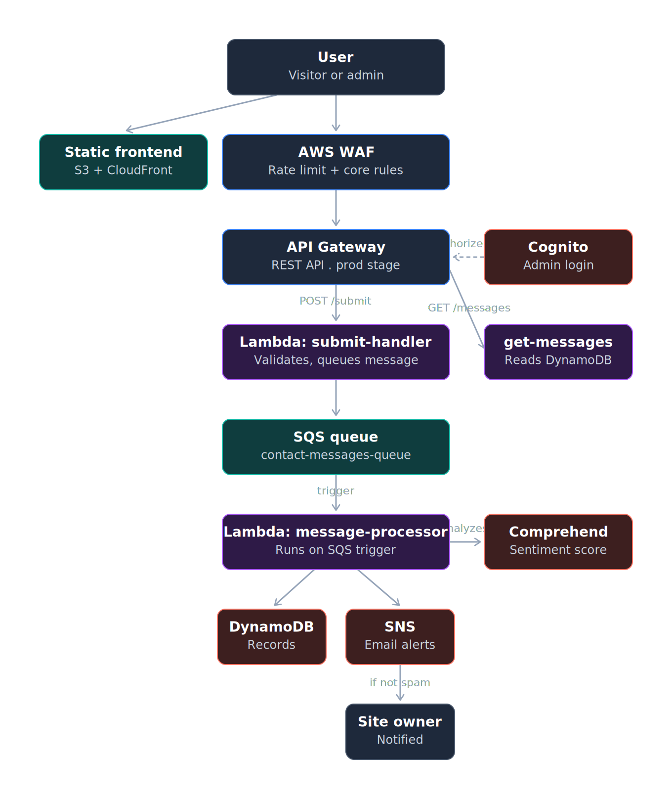
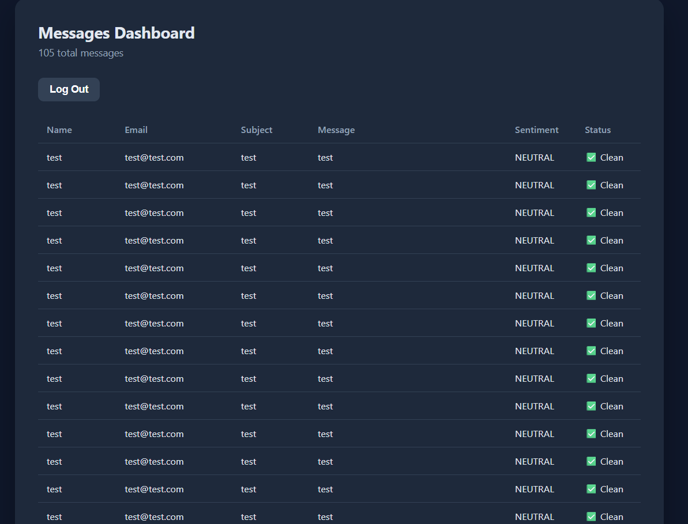

# 🛡️ Smart Contact Form — AI-Powered & Secured

> A serverless contact form that decouples submission from processing, filters spam using AI before it reaches an inbox, protects the API from bots and abuse, and gives the site owner a real authenticated dashboard — not just raw database access.

## Table of Contents
- [The Problem](#the-problem)
- [Architecture](#architecture)
- [Features](#features)
- [Live Test Result](#live-test-result)
- [Cost Decisions](#cost-decisions)
- [Possible Improvements](#possible-improvements)
- [Repository Structure](#repository-structure)

## The Problem

A public contact form is an easy target: spam bots submit junk 24/7, malicious actors probe it for exploits, and every submission — real or fake — normally lands straight in the owner's inbox with no filtering and no access control on who can view past messages.

This project builds a small defense-in-depth pipeline around a contact form to solve exactly that:

| Risk | How this project handles it |
|---|---|
| Bots hammering the endpoint | **AWS WAF** rate-limits and blocks abusive traffic at the edge |
| Spam / abusive messages reaching the inbox | **Amazon Comprehend** scores sentiment; suspicious messages are stored but never trigger a notification |
| Slow user experience while the backend does work | **SQS** decouples the request from processing — the user gets an instant response |
| Anyone with the DynamoDB console being able to read messages | **Cognito** locks the admin view behind real authentication |

## Architecture

| Layer | Service | Purpose |
|---|---|---|
| Frontend delivery | S3 (private) + CloudFront | Static site served over HTTPS, origin locked to CloudFront only |
| Edge protection | AWS WAF | Rate limiting + core exploit protection in front of the API |
| API | API Gateway (REST) | `POST /submit` (public), `GET /messages` (Cognito-authorized) |
| Decoupling | SQS | Submission is queued instantly; processing happens asynchronously |
| Compute | Lambda x3 (Python 3.12) | Submission intake, AI processing, admin data retrieval |
| AI filtering | Amazon Comprehend | Sentiment analysis used as an input to spam detection |
| Storage | DynamoDB | Stores messages with sentiment score and spam flag |
| Notifications | SNS | Emails the owner — only for messages that pass the spam check |
| Authentication | Amazon Cognito | Real login for the admin dashboard |

Region: `eu-north-1`

## Features

- **Async submission** — the user gets an instant response while AI analysis happens in the background
- **AI-assisted spam filtering** using Amazon Comprehend sentiment analysis combined with keyword heuristics
- **Bot and abuse protection** via AWS WAF rate limiting and AWS-managed core rules
- **Authenticated admin dashboard** — no more opening DynamoDB manually to read messages
- **HTTPS everywhere** via CloudFront, with a fully private S3 origin

## Live Test Result

Submitted both a normal message and a message containing spam markers. The normal message triggered an instant email notification; the spam message was silently flagged and stored without notifying the owner. Both were visible, correctly labeled, in the Cognito-authenticated admin dashboard.

## Cost Decisions

AWS WAF has **no Free Tier** — the "Recommended" rule package (which bundles Bot Control) was estimated at $58-59 per 10M requests/month, with fixed hourly charges regardless of real traffic. A custom, minimal rule pack (rate limiting + core rule set only, ~$11 baseline) was built instead, verified working, and the Web ACL was deleted immediately after capturing evidence — since this is a demo project with no real traffic to protect. Full reasoning in [`STEPS.md`](STEPS.md#step-10).

Every other component (S3, CloudFront, API Gateway, Lambda, SQS, DynamoDB, SNS, Cognito) has an always-free tier or near-zero idle cost and was left running.

## Possible Improvements

- Replace the keyword + sentiment spam heuristic with a custom-trained Comprehend classifier
- Add a Dead Letter Queue (DLQ) on the SQS queue to catch messages that fail processing repeatedly
- Move the WAF Web ACL into Infrastructure as Code (Terraform) so it can be recreated on demand for a live demo without manual reconfiguration
- Add CloudWatch alarms on Lambda error rates and SQS queue depth

## Repository Structure

    AWS-Smart-Contact-Form-Project/
    ├── README.md
    ├── STEPS.md              # Full step-by-step build log
    ├── CONCEPTS.md           # Design rationale for each decision
    ├── screenshots/
    ├── code/
    │   ├── lambda/
    │   │   ├── submit_handler/lambda_function.py
    │   │   ├── message_processor/lambda_function.py
    │   │   └── get_messages/lambda_function.py
    │   └── frontend/
    │       ├── index.html
    │       ├── admin.html
    │       ├── style.css
    │       ├── script.js
    │       └── admin.js
    └── iam/contact-lambda-policy.json
