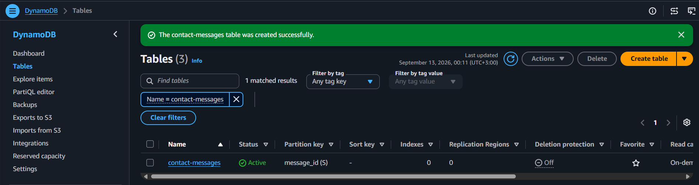
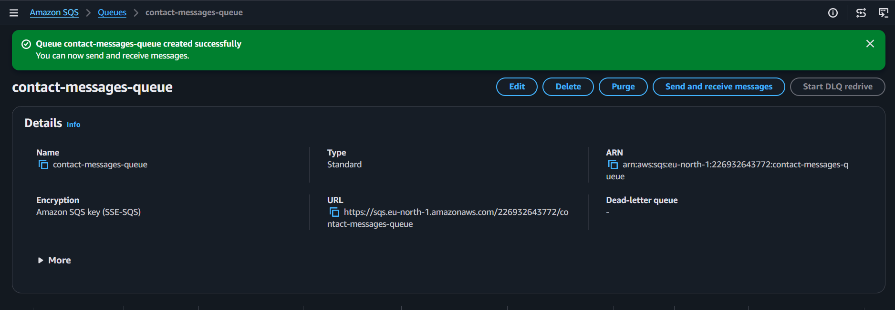
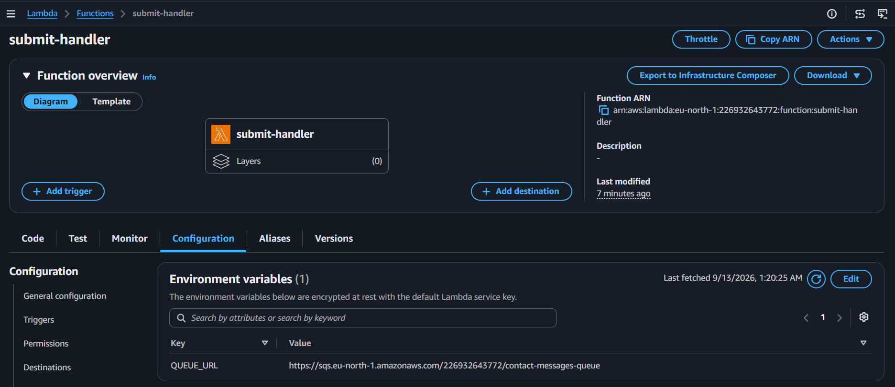
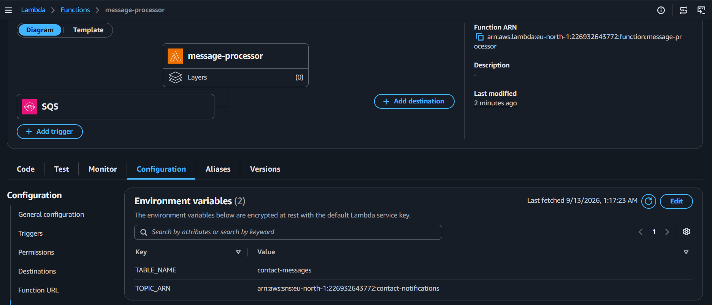
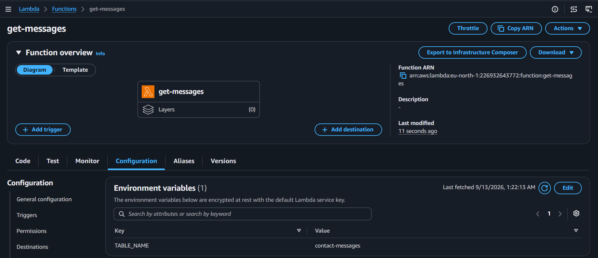
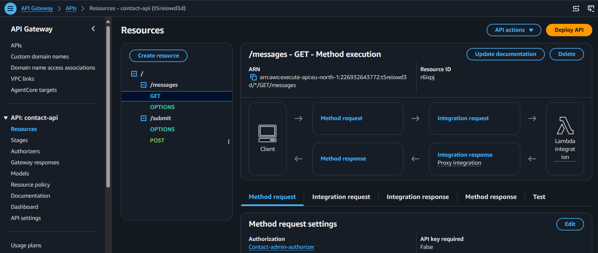
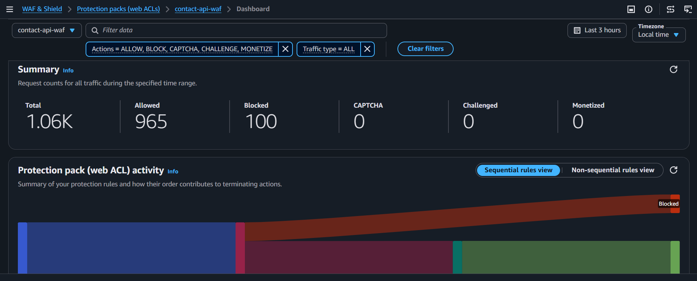

# 🛠️ Smart Contact Form — Build Steps

> Full step-by-step build log for the serverless Smart Contact Form, including screenshots, security configuration, testing, and cost decisions.

## Table of Contents

- [Step 1 — DynamoDB](#step-1--dynamodb)
- [Step 2 — SQS](#step-2--sqs)
- [Step 3 — SNS](#step-3--sns)
- [Step 4 — Cognito](#step-4--cognito)
- [Step 5 — IAM Role](#step-5--iam-role)
- [Step 6 — Submit Lambda](#step-6--submit-lambda)
- [Step 7 — Message Processor Lambda](#step-7--message-processor-lambda)
- [Step 8 — Get Messages Lambda](#step-8--get-messages-lambda)
- [Step 9 — API Gateway](#step-9--api-gateway)
- [Step 10 — AWS WAF](#step-10--aws-waf)
- [Step 11 — S3 + CloudFront](#step-11--s3--cloudfront)
- [Step 12 — CORS Restriction](#step-12--cors-restriction)
- [Step 13 — End-to-End Test](#step-13--end-to-end-test)

---

## Step 1 — DynamoDB

Create the DynamoDB table:

- **Table:** `contact-messages`
- **Partition key:** `message_id`
- **Type:** String
- **Capacity mode:** On-demand

The table stores every submitted message together with the processing result, including sentiment information and the spam flag.



---

## Step 2 — SQS

Create a Standard SQS queue:

- **Queue:** `contact-messages-queue`
- **Type:** Standard
- **Visibility timeout:** 30 seconds

SQS separates the public submission request from the slower processing pipeline. The submission Lambda can acknowledge the request quickly while the processor works asynchronously.



---

## Step 3 — SNS

Create the notification topic:

- **Topic:** `contact-notifications`
- **Type:** Standard
- **Subscription:** Email
- Confirm the email subscription

The notification Lambda publishes to SNS only when a message passes the spam check.


---

## Step 4 — Cognito

Create the Cognito User Pool:

- **Pool:** `contact-admin-pool`
- **Application type:** Traditional web application
- Create the admin user manually

Cognito is used to protect `GET /messages`, so stored contact messages are not publicly accessible.


---

## Step 5 — IAM Role

Create the Lambda execution role:

- **Role:** `contact-lambda-role`

The role is scoped to the services used by the application:

- CloudWatch Logs
- SQS
- DynamoDB
- SNS
- Amazon Comprehend

The policy is kept in the repository under `IAM/`.


---

## Step 6 — Submit Lambda

Create the first Lambda:

- **Function:** `submit-handler`
- **Runtime:** Python 3.12
- **Role:** `contact-lambda-role`
- **Timeout:** 10 seconds

Environment variables:

```text
QUEUE_URL
ALLOWED_ORIGIN
```

Code:

```text
code/lambda/submit_handler/lambda_function.py
```

Its job is to receive the public submission, validate the request, place the message onto SQS, and return a fast response to the user.



---

## Step 7 — Message Processor Lambda

Create the asynchronous processor:

- **Function:** `message-processor`
- **Runtime:** Python 3.12
- **Role:** `contact-lambda-role`

Environment variables:

```text
TABLE_NAME
TOPIC_ARN
```

Add `contact-messages-queue` as the SQS trigger.

Code:

```text
code/lambda/message_processor/lambda_function.py
```

The processor reads queued messages, performs sentiment analysis and spam checks, stores the result in DynamoDB, and publishes an SNS notification only when the message is not considered spam.




---

## Step 8 — Get Messages Lambda

Create the admin retrieval Lambda:

- **Function:** `get-messages`
- **Runtime:** Python 3.12
- **Role:** `contact-lambda-role`

Environment variables:

```text
TABLE_NAME
ALLOWED_ORIGIN
```

Code:

```text
code/lambda/get_messages/lambda_function.py
```

This Lambda reads stored messages from DynamoDB and returns them to the authenticated admin dashboard.



---

## Step 9 — API Gateway

Create the REST API:

- **API:** `contact-api`
- **Endpoint type:** Regional
- **Stage:** `prod`

Routes:

| Method | Path | Access | Integration |
| --- | --- | --- | --- |
| POST | `/submit` | Public | `submit-handler` |
| GET | `/messages` | Cognito-authorized | `get-messages` |

Configure the Cognito authorizer for `/messages`. API Gateway rejects unauthenticated requests before they reach the Lambda function.




---

## Step 10 — AWS WAF

Create a Regional WAF Web ACL for the API.

The test configuration used:

- Rate-based rule: **100 requests / 5 minutes**
- AWS-managed **Core Rule Set**
- Association with the API Gateway `prod` stage

The AWS WAF Recommended preset was not kept because it adds significant ongoing cost for a small portfolio project. The smaller custom configuration was sufficient to demonstrate rate limiting and managed-rule protection.

The WAF configuration was tested successfully, including blocked-request evidence.


### Cost Decision

AWS WAF has no Free Tier. Because this project is a demonstration and does not have production traffic, the Web ACL was **deleted immediately after testing and capturing screenshots**.

This keeps the protection concept documented without leaving a paid WAF resource running unnecessarily.

---

## Step 11 — S3 + CloudFront

Create the frontend hosting layer:

- Private S3 bucket: `contact-frontend-<account-id>`
- **Block Public Access:** On
- CloudFront distribution
- Origin Access Control (OAC)
- Viewer protocol policy: **Redirect HTTP to HTTPS**
- Default root object: `index.html`

The S3 bucket remains private and CloudFront is used as the public HTTPS entry point.


---

## Step 12 — CORS Restriction

After the CloudFront distribution was available, the Lambda CORS configuration was changed from:

```text
*
```

to the real CloudFront origin.

This prevents the backend from accepting browser requests from arbitrary origins.


---

## Step 13 — End-to-End Test

The complete application was tested through the deployed frontend.

### Normal Message

A normal contact message was submitted successfully and triggered the owner notification.


### Spam Message

A message containing spam markers such as:

```text
buy now
click here
```

was stored with:

```text
is_spam: true
```

and did not trigger the owner notification.


### Admin Dashboard

Both messages remained visible through the Cognito-authenticated admin dashboard, with the spam message correctly labeled.


### WAF Test Evidence

The WAF blocking behavior was verified during Step 10 before the Web ACL was deleted.




---

## Final Architecture


The project uses a defense-in-depth serverless flow:

```text
CloudFront
    │
    └── Private S3

Client
    │
    ▼
API Gateway
    │
    ├── POST /submit
    │       │
    │       ▼
    │   submit-handler
    │       │
    │       ▼
    │      SQS
    │       │
    │       ▼
    │ message-processor
    │       ├── Comprehend
    │       ├── DynamoDB
    │       └── SNS
    │
    └── GET /messages
            │
            ▼
        Cognito
            │
            ▼
       get-messages
            │
            ▼
        DynamoDB
```

See [`CONCEPTS.md`](CONCEPTS.md) for the reasoning behind the architecture and security/cost decisions.
