<a id="top"></a>

# 🛠️ Build Log — Smart Contact Form

A step-by-step record of every resource created, plus every real decision (including cost trade-offs) made along the way.

## 📋 Quick Navigation

| Step | Section |
|---|---|
| 1 | [🗃️ DynamoDB Table](#step-1) |
| 2 | [📬 SQS Queue](#step-2) |
| 3 | [📣 SNS Topic](#step-3) |
| 4 | [🔑 Cognito User Pool](#step-4) |
| 5 | [🔐 IAM Role & Policy](#step-5) |
| 6 | [⚡ Lambda: submit-handler](#step-6) |
| 7 | [⚡ Lambda: message-processor](#step-7) |
| 8 | [⚡ Lambda: get-messages](#step-8) |
| 9 | [🔌 API Gateway](#step-9) |
| 10 | [🛡️ AWS WAF](#step-10) |
| 11 | [🌍 S3 + CloudFront (OAC)](#step-11) |
| 12 | [🔒 CORS Restriction](#step-12) |
| 13 | [✅ End-to-End Test](#step-13) |

---

<a id="step-1"></a>
## Step 1 — 🗃️ DynamoDB Table

This stores every message along with its AI-generated sentiment and spam flag.

| Setting | Value |
|---|---|
| Name | `contact-messages` |
| Partition key | `message_id` (String) |
| Capacity mode | On-demand |

---

<a id="step-2"></a>
## Step 2 — 📬 SQS Queue

This decouples receiving a message from processing it — the user gets an instant response while the heavier work (AI analysis, storage, notification) happens in the background.

| Setting | Value |
|---|---|
| Name | `contact-messages-queue` |
| Type | Standard |
| Visibility timeout | 30 seconds |

---

<a id="step-3"></a>
## Step 3 — 📣 SNS Topic

Sends an email to the site owner, but only for messages that pass the spam check.

| Setting | Value |
|---|---|
| Topic name | `contact-notifications` |
| Type | Standard |
| Subscription | Email, confirmed |

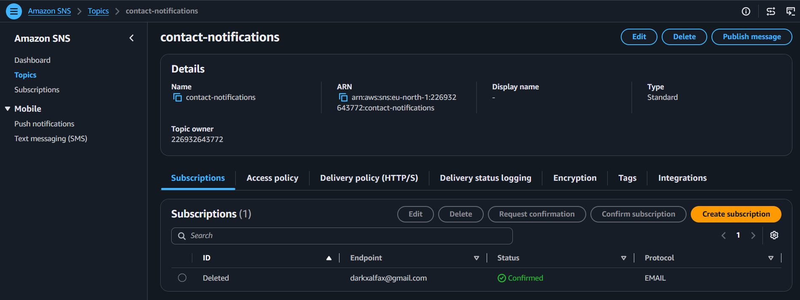

---

<a id="step-4"></a>
## Step 4 — 🔑 Cognito User Pool

This provides real authentication for the admin dashboard, instead of a hardcoded password in the frontend code.

| Setting | Value |
|---|---|
| Pool name | `contact-admin-pool` |
| Application type | Traditional web application |
| Admin user | Created manually in the Users tab |

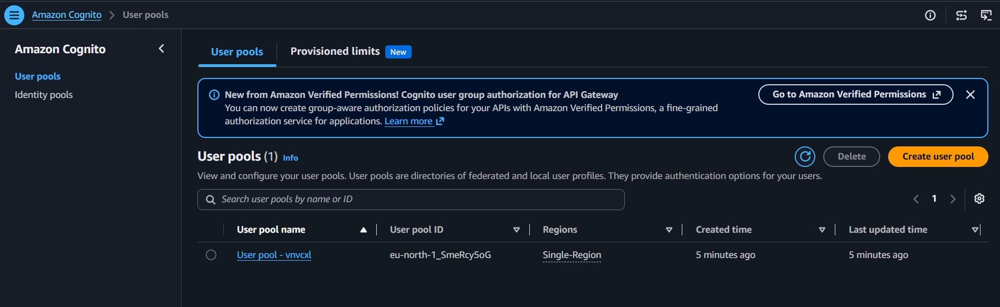
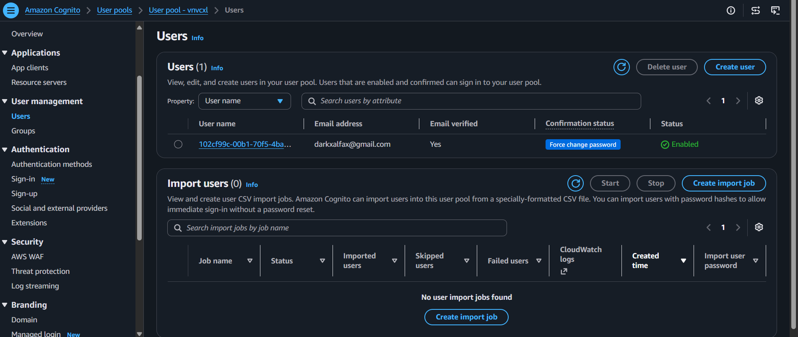

---

<a id="step-5"></a>
## Step 5 — 🔐 IAM Role & Policy

Scoped permissions covering SQS, DynamoDB, SNS, and Comprehend — nothing more than the three Lambda functions actually use.

```json
{
  "Version": "2012-10-17",
  "Statement": [
    {
      "Effect": "Allow",
      "Action": ["logs:CreateLogGroup", "logs:CreateLogStream", "logs:PutLogEvents"],
      "Resource": "*"
    },
    {
      "Effect": "Allow",
      "Action": ["sqs:SendMessage", "sqs:ReceiveMessage", "sqs:DeleteMessage", "sqs:GetQueueAttributes"],
      "Resource": "arn:aws:sqs:*:*:contact-messages-queue"
    },
    {
      "Effect": "Allow",
      "Action": ["dynamodb:PutItem", "dynamodb:Scan", "dynamodb:GetItem"],
      "Resource": "arn:aws:dynamodb:*:*:table/contact-messages"
    },
    {
      "Effect": "Allow",
      "Action": "sns:Publish",
      "Resource": "*"
    },
    {
      "Effect": "Allow",
      "Action": "comprehend:DetectSentiment",
      "Resource": "*"
    }
  ]
}
```

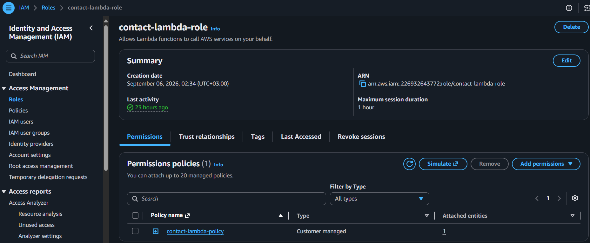

---

<a id="step-6"></a>
## Step 6 — ⚡ Lambda: submit-handler

Validates the incoming form quickly and pushes it to SQS — no heavy processing here, so the user gets an immediate response.

| Setting | Value |
|---|---|
| Name | `submit-handler` |
| Runtime | Python 3.12 |
| Role | `contact-lambda-role` |
| Env vars | `QUEUE_URL`, `ALLOWED_ORIGIN` |
| Timeout | 10 sec |

Full code: [`code/lambda/submit_handler/lambda_function.py`](code/lambda/submit_handler/lambda_function.py)

---

<a id="step-7"></a>
## Step 7 — ⚡ Lambda: message-processor

Triggered automatically by SQS. Runs the message through Amazon Comprehend, flags spam, stores the result, and notifies the owner only for legitimate messages.

| Setting | Value |
|---|---|
| Name | `message-processor` |
| Runtime | Python 3.12 |
| Role | `contact-lambda-role` |
| Env vars | `TABLE_NAME`, `TOPIC_ARN` |
| Trigger | SQS — `contact-messages-queue` |

Full code: [`code/lambda/message_processor/lambda_function.py`](code/lambda/message_processor/lambda_function.py)

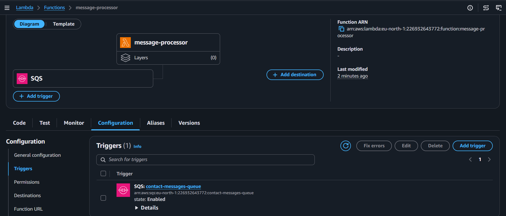

---

<a id="step-8"></a>
## Step 8 — ⚡ Lambda: get-messages

Returns every stored message (including flagged spam) to the authenticated admin dashboard.

| Setting | Value |
|---|---|
| Name | `get-messages` |
| Runtime | Python 3.12 |
| Role | `contact-lambda-role` |
| Env vars | `TABLE_NAME`, `ALLOWED_ORIGIN` |

Full code: [`code/lambda/get_messages/lambda_function.py`](code/lambda/get_messages/lambda_function.py)

---

<a id="step-9"></a>
## Step 9 — 🔌 API Gateway

Links the frontend to all three Lambda functions, with the admin endpoint locked behind Cognito.

| Setting | Value |
|---|---|
| API name | `contact-api` (REST, Regional) |
| `POST /submit` | Public → `submit-handler` |
| `GET /messages` | **Cognito-authorized** → `get-messages` |
| Stage | `prod` |

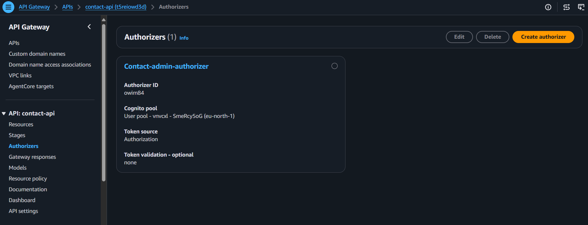
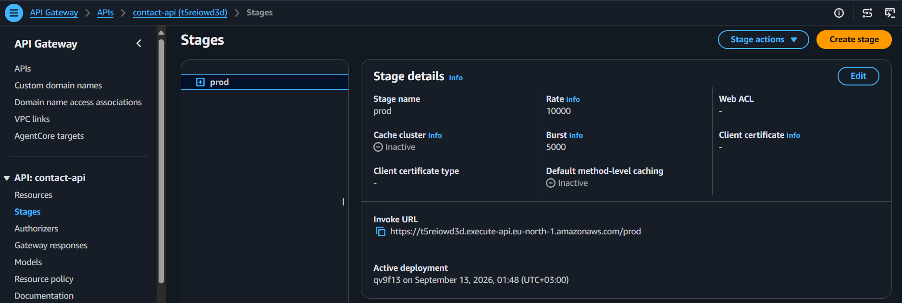

---

<a id="step-10"></a>
## Step 10 — 🛡️ AWS WAF

Adds a firewall layer in front of the API — rate limiting and core exploit protection.

| Setting | Value |
|---|---|
| Web ACL scope | Regional (`contact-api` / `prod`) |
| Rule 1 | Custom rate-based rule — 100 requests / 5 min, Block |
| Rule 2 | AWS-managed Core rule set |

> ⚠️ **Cost decision:** AWS WAF's "Recommended" preset (which bundles Bot Control) was estimated at **$58-59 per 10M requests/month** — and critically, **WAF has no Free Tier at all**; the Web ACL and each rule carry fixed hourly charges regardless of actual traffic. Built a custom pack instead with only the 2 rules actually needed (~$11 baseline estimate), captured evidence it was configured correctly, and **deleted the Web ACL immediately after** — this is a demo project with no real traffic to protect, so there's no reason to let a billable-by-the-hour resource sit idle.

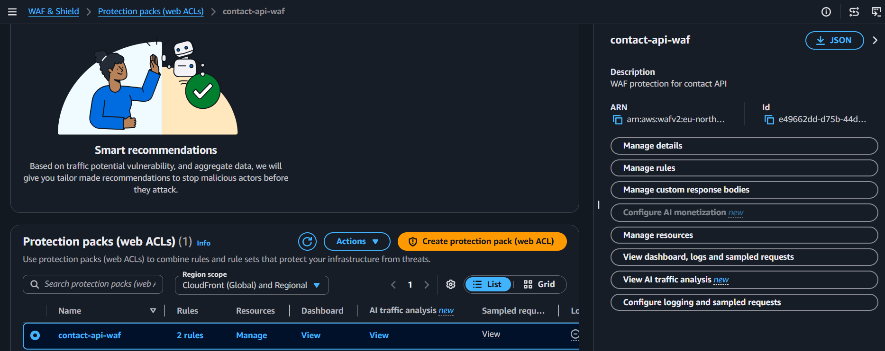
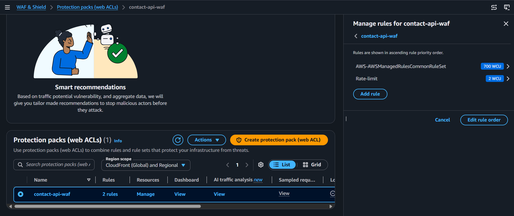

---

<a id="step-11"></a>
## Step 11 — 🌍 S3 + CloudFront (Private, via OAC)

Same hardened pattern as the Feedback Form project — the bucket stays fully private, and only CloudFront can read from it.

| Setting | Value |
|---|---|
| Bucket | `contact-frontend-<account-id>` — Block all public access: **On** |
| CloudFront origin access | Origin Access Control (OAC) |
| Viewer protocol policy | Redirect HTTP to HTTPS |
| Default root object | `index.html` |

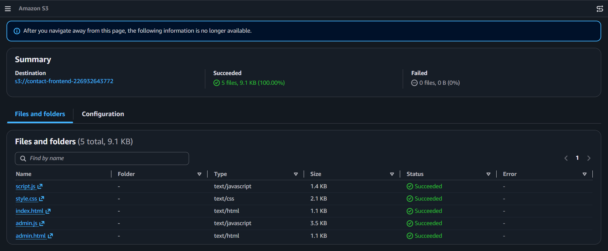
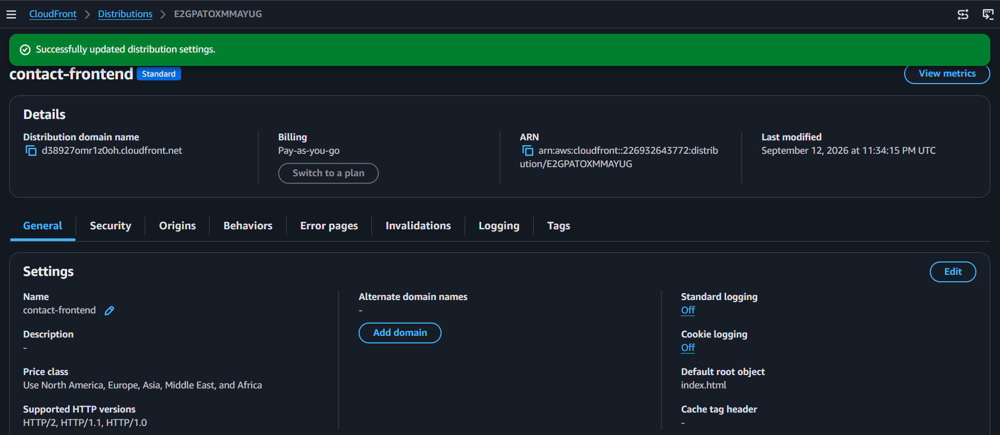
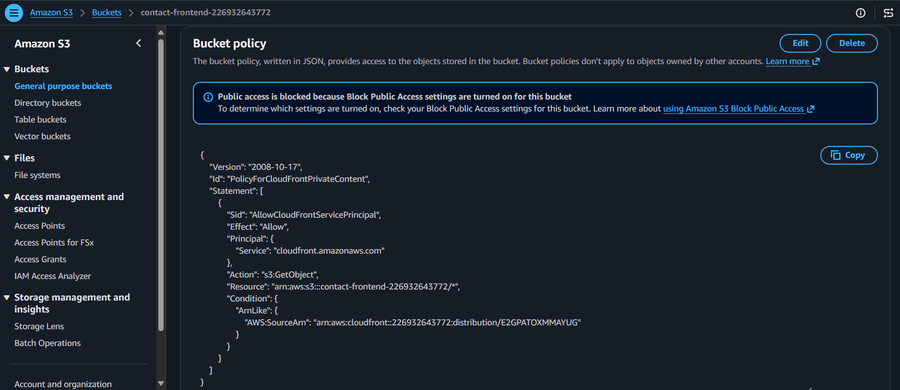

---

<a id="step-12"></a>
## Step 12 — 🔒 CORS Restriction

Updated `ALLOWED_ORIGIN` on both public-facing Lambdas from `*` to the real CloudFront domain.

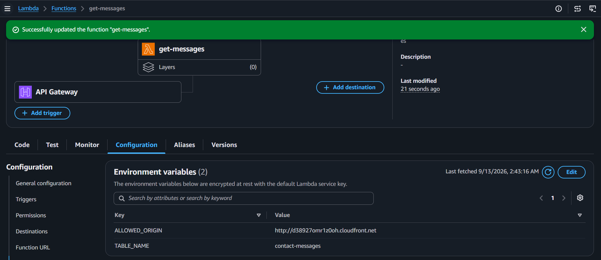

---

<a id="step-13"></a>
## Step 13 — ✅ End-to-End Test

A final check across the whole pipeline — submission, AI filtering, and the protected admin view.

1. Submitted a normal message → received a confirmation, and the owner's inbox got a notification email.
2. Submitted a message containing spam markers ("buy now", "click here") → stored with `is_spam: true`, **no** notification email sent.
3. Logged into the admin dashboard with the Cognito account → saw both messages listed, spam clearly flagged.

> **Note:** the WAF rate-limit block behavior was verified during Step 10 configuration, but not re-tested here since the Web ACL was already torn down to avoid ongoing charges.

| Check | Result |
|---|---|
| Normal message → notification sent | ✅ |
| Spam message → flagged, no notification | ✅ |
| Admin dashboard shows all messages | ✅ |
| WAF rules validated (Step 10) | ✅ |

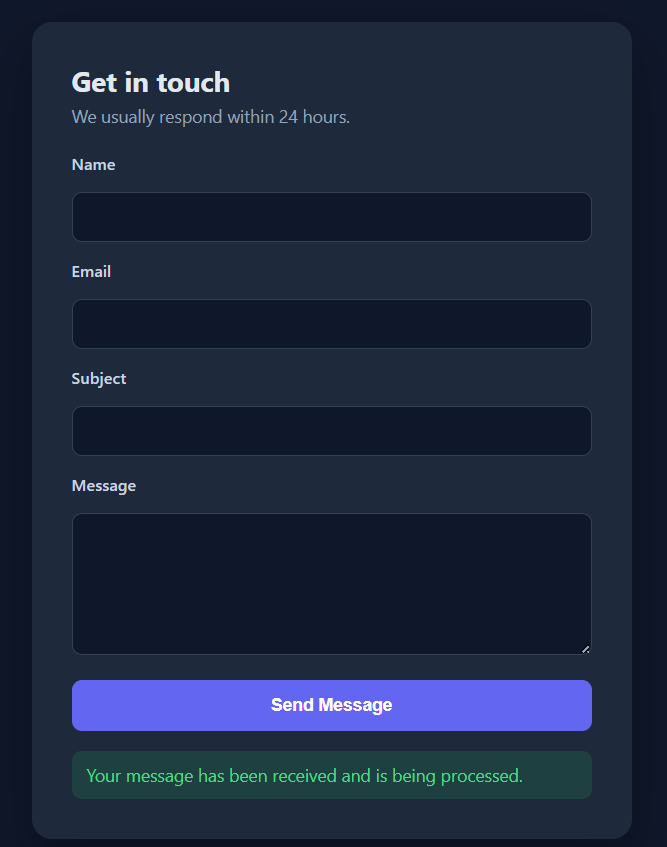
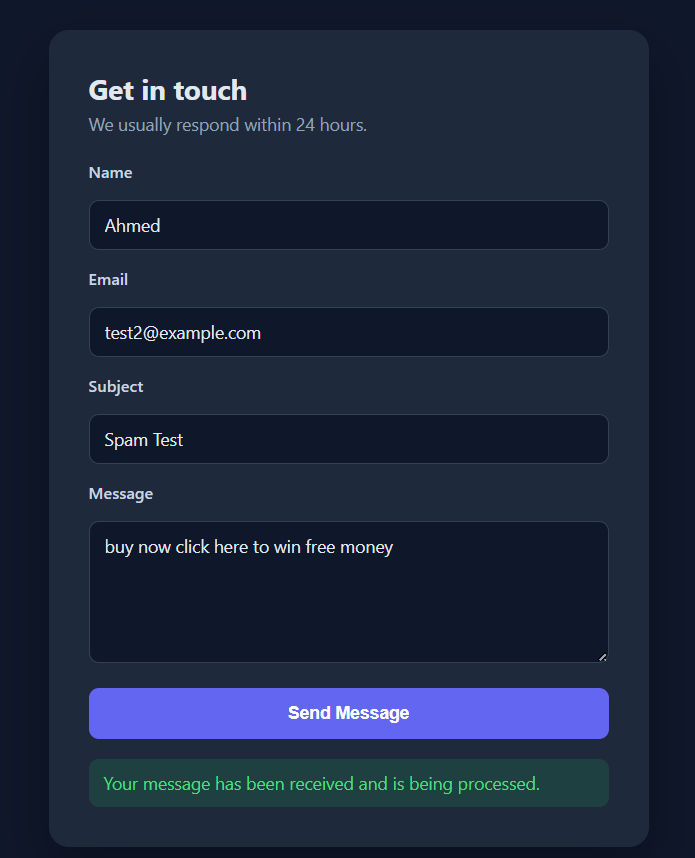


---

<div align="center">

**[⬆ Back to top](#top)**

</div>
